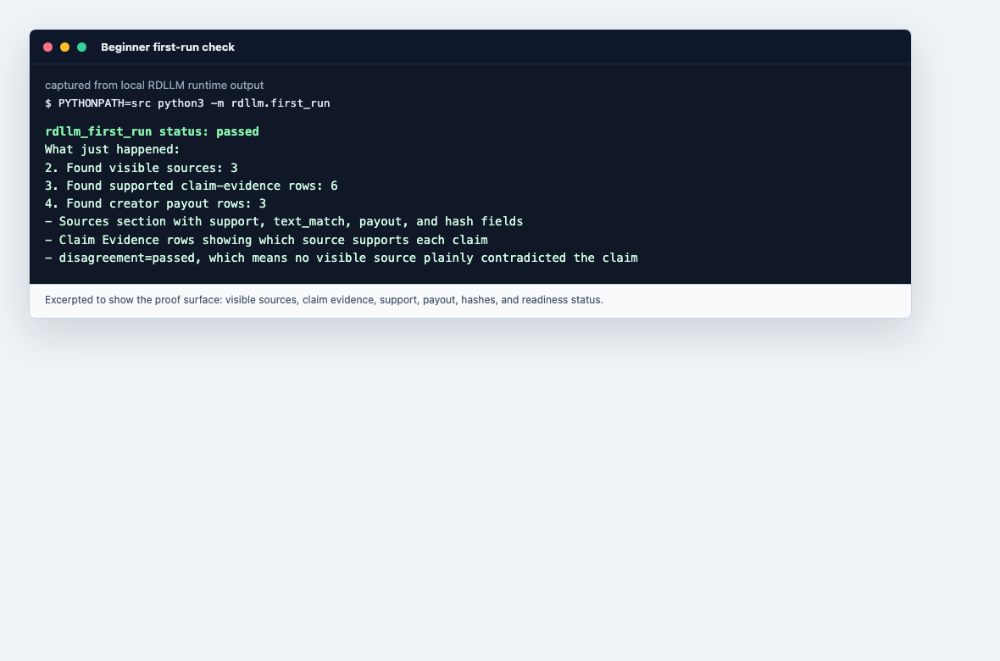
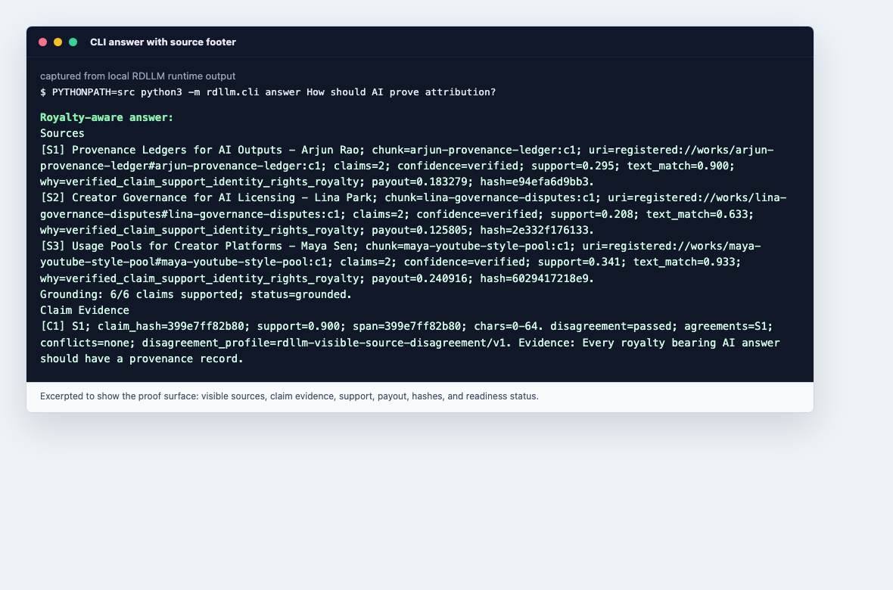
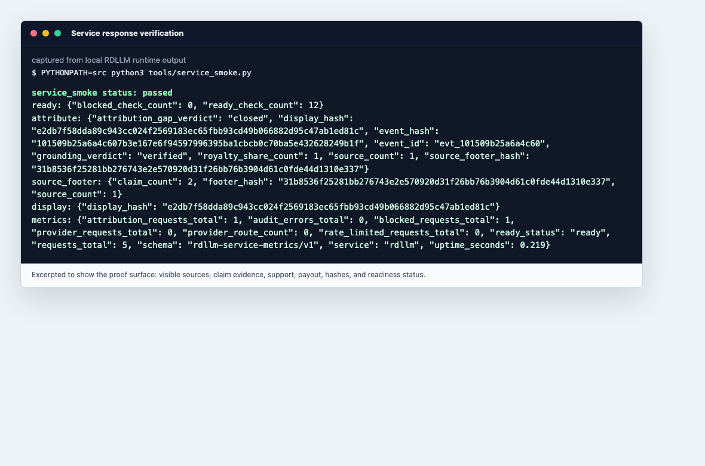
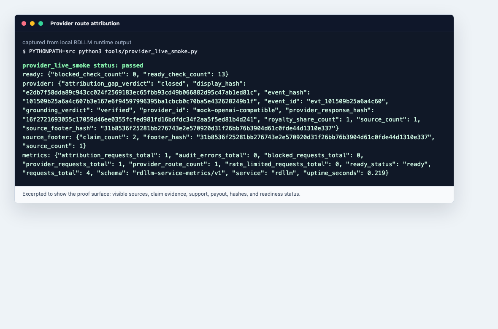

# RDLLM Live Use Cases

These use cases are copyable from a source checkout. They show the user-facing
answer surface and the backend attribution fields together, so builders can see
where each claim, source, support score, and payout number appears.

## Live Screenshot Gallery

These screenshots are captured from local RDLLM runtime commands. They are
short excerpts so the page stays readable.









Read the screenshots this way:

- `status: passed` means the command completed its own verification.
- `Sources`, `[S#]`, `Claim Evidence`, `support`, `text_match`, and `payout`
  are the visible attribution surface.
- `grounding_verdict`, `source_footer_hash`, `display_hash`, and
  `provider_response_hash` are machine-checkable runtime handles.

## Use Case 1: Explain Attribution In A CLI Answer

```bash
PYTHONPATH=src python3 -m rdllm.cli answer "How should AI prove attribution?"
```

Expected visible surface:

```text
Royalty-aware answer:
The strongest registered sources say:
- Every royalty bearing AI answer should have a provenance record... [S1]

Sources
[S1] Provenance Ledgers for AI Outputs - Arjun Rao; ... support=0.295; text_match=0.900; ... payout=0.183279; hash=e94efa6d9bb3.

Claim Evidence
[C1] S1; claim_hash=399e7ff82b80; support=0.900; span=399e7ff82b80; chars=0-64. disagreement=passed; agreements=S1; conflicts=none; disagreement_profile=rdllm-visible-source-disagreement/v1. Evidence: Every royalty bearing AI answer should have a provenance record.
```

How to read it:

- `support` on a source row is the source's observable contribution to the final
  output.
- `text_match` is the overlap signal between output text and registered source
  text.
- `payout` is the creator-pool amount allocated to that source owner.
- `Claim Evidence` binds a generated claim to a source label and evidence span.
- `disagreement=passed` means no visible high-overlap source plainly contradicted
  that claim.

## Use Case 2: Run The Service And Verify A Displayable Answer

Terminal 1:

```bash
export RDLLM_SERVICE_TOKEN="${RDLLM_SERVICE_TOKEN:-rdllm-local-dev-token}"
export RDLLM_SERVICE_TOKEN_SHA256="$(python - <<'PY'
import hashlib
import os
print(hashlib.sha256(os.environ["RDLLM_SERVICE_TOKEN"].encode()).hexdigest())
PY
)"
PYTHONPATH=src python3 -m rdllm.service --config examples/service_config.json
```

Terminal 2:

```bash
curl -sS \
  -H "Authorization: Bearer $RDLLM_SERVICE_TOKEN" \
  -H "Content-Type: application/json" \
  -d '{
    "prompt": "What should royalty-bearing AI answers expose?",
    "output": "Every royalty-bearing AI answer should expose grounded sources, claim evidence, and payout or escrow state.",
    "gross_revenue": "1.00"
  }' \
  http://127.0.0.1:8765/v1/attribute > /tmp/rdllm-response.json
```

Verify copied/exported display text:

```bash
python - <<'PY'
import json
from pathlib import Path
response = json.loads(Path("/tmp/rdllm-response.json").read_text())
Path("/tmp/rdllm-display.txt").write_text(response["display"]["rendered_text"], encoding="utf-8")
Path("/tmp/rdllm-footer.json").write_text(json.dumps(response["source_footer"]), encoding="utf-8")
PY
PYTHONPATH=src python3 tools/service_response_verify.py --response /tmp/rdllm-response.json --display-text /tmp/rdllm-display.txt
PYTHONPATH=src python3 tools/source_footer_verify.py --footer /tmp/rdllm-footer.json --display-text /tmp/rdllm-display.txt
```

The verifier must report:

```text
production_display_ready: true
source_grounding_acceptance: passed
claim_source_disagreement_status: passed
```

## Use Case 3: Test Provider-Backed Attribution

```bash
PYTHONPATH=src python3 tools/provider_live_smoke.py
```

This uses the configured OpenAI-compatible mock route by default. It proves that
provider output is captured, hashed, attributed, rendered with a source footer,
and verified before display.

## Use Case 4: Check Production Launch Readiness

```bash
PYTHONPATH=src python3 tools/ship_check.py --skip-tests --skip-regenerate
PYTHONPATH=src python3 tools/production_readiness.py
```

Use this before publishing a release, demo, hosted proof surface, or deployment.
The launch path should fail closed when source footer verification, copied-text
preservation, attribution-gap closure, or settlement controls are missing.

## Use Case 5: Call The HTTP API From App Code

Use the language-specific examples in [API clients](../api_clients/README.md).
Every example calls `/v1/attribute`, reads `display.rendered_text`, and checks
the fields that matter to a user:

- visible source footer;
- claim evidence;
- source usage metrics;
- payout or escrow state;
- verifier-ready display text.

## Use Case 6: Give A Beginner A One-Command Proof

Use this in a README, workshop, demo booth, or first install path.

```bash
python -m pip install .
rdllm-first-run
```

Expected first line:

```text
rdllm_first_run status: passed
```

This proves the package can generate an answer, show visible sources, count
claim-evidence rows, and expose creator payout rows without an API key.

## Use Case 7: Reconcile Creator Royalty Events

Use this when a creator platform or publisher wants to inspect the ledger events
behind attribution.

```bash
PYTHONPATH=src python3 -m rdllm.cli demo --ledger artifacts/demo_ledger.json
```

Look for event IDs, royalty shares, creator-pool allocation, and receipt hashes.
This is the path to show that attribution is not only a citation footer; it also
becomes an auditable settlement event.

## Use Case 8: Publish A Public Proof Pack

Use this before putting proof artifacts behind GitHub Pages, a static site, or a
well-known discovery URL.

```bash
PYTHONPATH=src python3 tools/hosting_export.py --check
PYTHONPATH=src python3 tools/hosted_surface_audit.py
```

The first command checks that exported schemas and proof artifacts are current.
The second checks that the hosted public surface contains the expected manifest,
schemas, and RDLLM proof artifacts.

## Use Case 9: Check The Public Surface For Secrets

Use this before publishing generated docs, receipts, or well-known artifacts.

```bash
PYTHONPATH=src python3 tools/public_surface_privacy_audit.py
```

The audit is meant for public-facing releases. It checks that exported proof
files do not leak private prompts, tokens, private keys, or hidden operator
state.

## Use Case 10: Check Provider Family Compatibility

Use this when adding, removing, or renaming model-provider routes.

```bash
PYTHONPATH=src python3 tools/provider_matrix.py --check
PYTHONPATH=src python3 tools/provider_family_audit.py
```

These checks make sure provider families are consistently represented across
runtime adapters, provider matrices, adoption docs, and public proof artifacts.

## Use Case 11: Load-Test The Attribution Service

Use this before a hosted demo, customer pilot, or internal launch.

```bash
PYTHONPATH=src python3 tools/service_load_smoke.py
```

Expected output includes `service_load_smoke status: passed`, request count,
concurrency, elapsed seconds, and service metrics. It proves the service can
handle concurrent attribution requests while preserving ready metrics.

## Use Case 12: Test Abuse, Rate Limit, And Provider-Failure Paths

Use this when RDLLM sits on a public endpoint.

```bash
PYTHONPATH=src python3 tools/security_abuse_smoke.py
```

Expected output includes `security_abuse_smoke status: passed`. It checks abuse
cases, rate limiting, and provider-failure handling so unsafe or failed requests
do not become confident grounded answers.

## Use Case 13: Verify The Installable Package

Use this before tagging a release or telling users to install from the package.

```bash
PYTHONPATH=src python3 tools/package_smoke.py
```

This builds the wheel and source distribution, installs them in an isolated
environment, runs the demo, and verifies console scripts such as
`rdllm-first-run`, `rdllm-service`, and the verifier commands.

## Use Case 14: Compare Operator Acceptance Profiles

Use this when deciding whether RDLLM is ready for an individual, company,
institution, government, or public-sector deployment profile.

```bash
PYTHONPATH=src python3 tools/production_profile_matrix.py
PYTHONPATH=src python3 tools/operator_acceptance_matrix.py
```

The outputs show which profiles allow direct settlement, escrow-only settlement,
public-sector use, and production-grade claims.

## Use Case 15: Audit The GitHub-Facing Documentation

Use this before publishing the repo, README, docs site, or examples to users.

```bash
PYTHONPATH=src python3 tools/docs_link_audit.py
PYTHONPATH=src python3 tools/github_docs_readiness_audit.py
```

These checks keep the public entry points grounded: beginner docs, live use
cases, API clients, multilingual quickstarts, source-field examples, and local
links all have to be present and valid.
