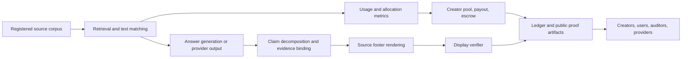

# RDLLM: Verifiable Source Attribution and Creator-Value Accounting for Grounded AI Outputs

Version: 2026-07-10

Author: Siddharth Nilesh Patel

Status: public technical white paper

Document label: RDLLM White Paper

Companion artifacts:

- Runtime walkthrough: `docs/first_5_minutes.md`
- Live examples: `examples/live_use_cases/README.md`
- Public explainer: `docs/public_explainer.md`
- Research notes: `docs/recent_research.md`
- Bibliography: `paper/references.bib`

## Abstract

Royalty Driven LLM Model (RDLLM) is a provider-neutral reference architecture for
making AI answers visibly grounded, auditable, and economically accountable. The
central claim is narrow but important: when an AI product uses registered
sources, retrieved evidence, generated text, or provider-native source metadata
to produce a public answer, the system should show users which sources support
the answer, explain how those sources were used in observable allocation terms,
and route creator value to payment, review, or escrow rather than silently
absorbing it.

RDLLM combines four layers that are usually treated separately:

1. User-facing grounding: inline source labels, source rows, and Claim Evidence
   rows that bind claims to exact source spans.
2. Attribution measurement: retrieval relevance, output support, text overlap,
   citation presence, and registered data-value priors with metric provenance.
3. Settlement accounting: creator-pool allocation, escrow routing, rights
   conflicts, registry disputes, and remittance-ready statements.
4. Verifiable operation: response hashes, Ed25519 signatures, source-footer
   hashes, event hashes, audit logs, public schemas, externally signed deployment
   evidence, launch gates, and package/runtime smoke checks.

The design is shaped by recent citation and attribution research showing that
source-looking citations are often insufficient: links can work without factual
support; citations can be topically relevant but over-warrant the claim; models
can cite sources that did not meaningfully influence generation; and deployed
LLM search systems can consume relevant pages without crediting them. RDLLM
therefore treats attribution as a runtime contract, not a decorative citation
style.

The system does not claim to reveal hidden model-internal reliance unless a
provider supplies separately verified model-signal telemetry. Its default
runtime reports observable source support and settlement allocation. That
discipline is intentional: it keeps the user-facing footer honest while still
making the economics of source use visible and challengeable.

## Executive Summary

Most public conversations about AI and creators collapse three different
questions into one:

- Did the AI answer cite any sources?
- Did the answer actually use or rely on those sources?
- Should the people behind those sources receive value?

RDLLM separates the questions and then reconnects them through a common evidence
trail. A source footer should not be only a user-interface feature. It should be
the visible edge of a verifiable event containing source identity, claim support,
evidence spans, source-access traces, rights policy, source-usage metrics,
allocation weights, payout or escrow status, and hashes that allow independent
verification.

The reference implementation is deliberately practical. A new user can run:

```bash
python -m pip install .
rdllm-first-run
```

The packaged synthetic first-run path emits `rdllm_first_run status: passed`, visible
source rows, Claim Evidence rows, `support`, `text_match`, `payout`, and
`disagreement=passed` fields. Here, `payout` is a candidate creator-pool
allocation, not evidence that money moved. The same repository includes service smoke tests,
provider-route smoke tests, package smoke tests, link audits, public proof
artifacts, and production-readiness gates.

The key product principles are:

1. Show the source at the point of use.
2. Bind every support-bearing claim to evidence, not just to a document.
3. Separate link validity, topical relevance, factual support, evidence force,
   source identity, and behavioral influence.
4. Publish the metric profile behind any usage number.
5. Route uncertain or blocked value into escrow, not silent capture.
6. Preserve source footers through API delivery, copy/export, and downstream
   reuse.
7. Make provider, operator, and verifier claims machine-checkable.
8. Avoid claiming hidden model-internal reliance unless separate telemetry proves
   it.

## 1. The Problem

Generative AI creates value by synthesizing information, style, structure,
evidence, and prior work. The output might be a search answer, a customer-support
reply, a research synthesis, a code snippet, a legal memo, a product
recommendation, a creative draft, or an agent action. In many deployments the
answer is monetized through subscriptions, advertising, enterprise contracts,
API calls, marketplace transactions, or productivity gains. The source works
that make the answer useful often remain invisible to the user and unpaid by the
operator.

This is not just a copyright or payout problem. It is a trust problem. Users
often interpret citations as signals of reliability, but recent research shows
that source-looking citations can fail in several ways:

- A link can resolve while the cited content does not support the claim.
- A citation can be relevant but too weak for the wording attached to it.
- A model can attach a citation through a learned citation behavior that is not
  proof of internal reliance.
- A generated answer can contain extra factual claims that have no source row.
- A provider can retrieve or read more sources than it credits.
- A source can support a fact somewhere while the displayed citation points to
  the wrong source.

The economic problem follows from the trust problem. If a system cannot explain
which sources were consumed, displayed, supported, disputed, or withheld, it also
cannot defensibly allocate money to creators. Conversely, if the system has a
payout ledger but the user-facing answer strips the source footer, the user has
no reason to trust the answer or the royalty accounting.

RDLLM addresses both sides with the same mechanism: source attribution and value
attribution share the same event record.

## 2. Design Scope And Non-Claims

RDLLM is a reference architecture and implementation for observable attribution.
It is not a court, a collective management organization, a payment processor, or
a magic inspection window into closed model internals.

RDLLM can support these claims when the corresponding artifacts are present:

- This answer displayed these source rows.
- These answer claims had these evidence rows.
- This source row exposed support, text match, allocation weight, payout, and
  metric provenance.
- The displayed footer matched the event source metadata.
- The display text included the verified source footer.
- The service or package passed a named verifier or smoke test.
- A creator-pool amount was allocated to source rows, escrow, or review.
- A public artifact was exported and validated against a schema.

RDLLM should not claim these things without additional provider evidence:

- The model internally reasoned from a source.
- A source causally determined a token sequence.
- A hidden pretraining example was responsible for an output.
- A payout row proves legal entitlement.
- A working URL proves factual support.
- A source-looking answer is safe without display verification.

This boundary matters because current research increasingly separates visible
citations, factual support, and behavioral influence. RDLLM's default source
usage profile is therefore named
`rdllm-observable-source-usage-metrics/v1`, with scope
`observable_support_allocation_not_model_internal_reliance`.

## 3. State Of The Art

This section summarizes the research and standards base that shapes RDLLM as of
July 8, 2026. The point is not that any one paper proves RDLLM. The point is
that the current evidence converges on a practical engineering rule: source
credit must be claim-level, evidence-bound, metric-scoped, and independently
verifiable.

### 3.1 Citation Validity Is Not Factual Support

`Cited but Not Verified` evaluates source attribution in LLM deep-research
agents by parsing generated Markdown citations, retrieving the actual cited
content, and separately scoring link accessibility, topical relevance, and
factual support. Its headline result is the gap between surface citation quality
and factual reliability: frontier systems can maintain high link validity and
topical relevance while factual accuracy remains substantially lower. It also
reports that increasing research depth can reduce fact-check accuracy rather
than improve it.

RDLLM consequence: a source row cannot be treated as grounded merely because a
URL exists. RDLLM requires source identity, evidence spans, Claim Evidence rows,
and verifier status.

### 3.2 Citation Behavior Is Not Necessarily Model Reliance

`How Do LLMs Cite?` studies inline citation behavior mechanistically and finds a
distributed citation mechanism rather than a simple faithful-use marker. The
paper argues that inline citations can create false security when users treat
them as proof of source reliance.

`ProvenAI` similarly separates answer correctness, citation fidelity, and
per-document influence. Its examples show that cited documents and influential
documents can diverge.

RDLLM consequence: the runtime does not say "the model relied on S1" by default.
It says the answer displayed S1, claims were supported by S1 evidence, and the
creator-pool allocation used published observable metrics. Hidden model reliance
requires separate telemetry.

### 3.3 Citation Evaluation Needs Retrieval-Aware Validation

`CiteGuard` reframes citation evaluation as citation-attribution alignment and
uses retrieval-augmented validation rather than trusting an LLM judge alone. The
paper reports accuracy close to human performance on its benchmark, while still
showing that evaluation remains non-trivial.

RDLLM consequence: validators should retrieve or materialize the source being
credited. RDLLM therefore binds source URI, source hash, evidence span hash,
verification handle, and display hash.

### 3.4 Claim-Evidence Interfaces Beat Document-Level Citations

`PaperTrail` argues that scholarly QA systems need claim/evidence mappings, not
only broad source citations. It decomposes generated answers and source documents
into discrete claims and evidence so users can see supported claims, unsupported
claims, and omissions.

`Explicit Evidence Grounding via Structured Inline Citation Generation`
introduces a framework that links claims to source documents and evidence spans,
and finds that precise evidence-span identification remains harder than
document-level citation.

RDLLM consequence: every supported claim should expose a Claim Evidence row with
source label, claim hash, support score, evidence span hash, character offsets,
and evidence preview.

### 3.5 Relevance Is Not Warrant

`Relevant Is Not Warranted` describes citation laundering: a real and relevant
source can be used to justify a stronger claim than the evidence warrants. Its
FORCEBENCH stress test examines relation, modality, scope, temporal validity,
and numeric specificity.

RDLLM consequence: evidence must be calibrated against the force of the claim.
RDLLM uses warrant and disagreement checks to prevent a merely related source
from becoming a confidence signal for an over-strong answer.

### 3.6 Claim-Source Closure Matters

`Citation-Closure Retrieval and Per-Rule Attribution` shows that regulated
workflows require evidence-set closure and per-rule attribution, not flattened
post-hoc source lists.

`ProvenanceGuard` identifies cross-source conflation: a claim may be supported
somewhere while attributed to the wrong source. It verifies MCP-grounded answers
against captured tool traces, stable source IDs, and per-claim evidence routing.

RDLLM consequence: a claim must bind to the same visible source row, work ID,
and chunk ID that the footer displays. It is not enough for the claim to be
supportable somewhere in the corpus.

### 3.7 The Attribution Gap Is A Product Risk

`The Attribution Crisis in LLM Search Results` defines the attribution gap as
relevant content consumed by search-enabled LLM systems minus sources credited in
the answer. Its measurements show that provider design choices can materially
change how many consumed sources receive visible credit.

RDLLM consequence: accessed, retrieved, or text-matched sources must be visible,
paid, or explicitly routed to escrow/review. Silent consumption is a failure
state.

### 3.8 Attribution Metrics Do Not Transfer Automatically

`Do LLM Attribution Metrics Transfer?` audits automatic attribution metrics
across datasets and constructs and finds that metric rankings can invert. It
warns against treating a support or entailment metric as universal without
target validation.

RDLLM consequence: every visible usage metric must disclose its profile, scope,
and method. RDLLM footers expose methods such as
`rdllm-claim-overlap-support/v1` and
`rdllm-ngram-lcs-text-match/v1`, and the verifier rejects rows that omit metric
provenance.

### 3.9 Compensation Must Reflect Attribution Uncertainty

`What's a Credit Worth?` models creator compensation when an attribution signal
is noisy. Its generative-music experiments compare scalable attribution with a
leave-one-catalog-out reference and show that attribution informativeness changes
the welfare-optimal contract: noisier signals favor fixed-fee licensing over
royalty-based allocation.

RDLLM consequence: a score must not mechanically become a payment. Low-confidence,
post-hoc, disputed, or unsupported matches route to review or escrow. Operators
should calibrate attribution against a domain-relevant reference before using
royalty contracts, and should consider fixed-fee or collective licensing where
answer-level attribution is too noisy.

### 3.10 Training-Data Attribution Is A Separate Evidence Channel

`Data Attribution in Large Language Models via Bidirectional Gradient
Optimization` studies training-data attribution by perturbing a model on generated
text and measuring loss changes over training samples. This is materially different
from proving which retrieved context supports a displayed answer, and it generally
requires model and training-data access unavailable at a provider-neutral API edge.

RDLLM consequence: answer-time source grounding, observable text matching, and
training-data influence must remain separate fields. A response footer never
upgrades a retrieved source into a training-influence claim. Model-level signals
can be attached only as separately scoped evidence with their own method,
calibration, access assumptions, and uncertainty.

### 3.11 Standards Are Converging On Portable, Verifiable Provenance

W3C PROV defines provenance as information about entities, activities, and
people involved in producing data or things, used to assess quality, reliability,
or trustworthiness. W3C Verifiable Credentials 2.0 defines a machine-verifiable
credential model with privacy and security considerations. C2PA's Content
Credentials specification focuses on tamper-evident media provenance and
preserving provenance through changes. IETF SCITT RFC 9943 standardizes an
architecture for signed statements and transparency services in digital supply
chains. NIST AI 600-1 frames provenance, evaluation, and risk management as
operational responsibilities for generative AI systems.

RDLLM consequence: source attribution should not be trapped in a single vendor
JSON object. RDLLM emits schemas, public artifacts, hashes, verifier commands,
and well-known discovery surfaces so downstream systems can verify what happened.

### 3.12 Policy Is Moving Toward Transparency And Rights Accounting

The EU AI Act establishes transparency and copyright-related obligations for
general-purpose AI models, including public summaries of training content. The
U.S. Copyright Office's AI initiative and its Part 3 report on generative AI
training address the legal and policy tensions around copyrighted training data,
licensing, and market harm.

RDLLM consequence: technical attribution cannot decide all legal questions, but
it can provide the evidence substrate that licensing, opt-out, rights review,
creator challenge, and settlement processes need.

## 4. RDLLM Conceptual Model

RDLLM models each monetized AI interaction as an attribution event.

An event contains:

- request metadata: prompt hash, route, policy version, provider metadata;
- answer metadata: answer text, display text, display hash;
- generation evidence: local retrieval mode or provider request/response hashes,
  supplied context hash, provider response ID, source IDs, and citation annotations;
- source records: creator ID, work ID, chunk ID, URI, content hash, license,
  rights policy, registry status;
- evidence records: claim hash, evidence span hash, evidence preview, support
  score, warrant status, disagreement status;
- usage metrics: retrieval relevance, output support, prompt overlap, text
  match, citation score, data-value prior, metric methods;
- settlement fields: gross revenue, creator-pool rate, creator pool,
  contribution weight, candidate allocation, escrow or review reason, and an
  explicit no-direct-execution decision;
- verification fields: source-footer hash, event hash, Ed25519 receipt signature,
  audit entry, public verifier outputs, and externally signed deployment evidence.

The event has three audiences:

1. End users need a compact, readable answer footer.
2. Creators need attribution, challenge, and settlement evidence.
3. Operators, providers, auditors, and regulators need machine-checkable proofs.

The same event should serve all three without exposing private prompts, private
source text, payment account details, or customer data.

## 5. Runtime Architecture



### 5.1 Source Registration

Source registration binds a creator, work, chunk, content hash, URI, license,
policy, and registry status. The design separates text matching from rights
ownership. A hash can show that a source was registered or matched; it cannot
alone decide whether a claimant is legally entitled to royalties. Disputes route
to review or escrow.

### 5.2 Retrieval And Source Access

The runtime records which sources were retrieved, matched, or accessed. This
prevents a common attribution gap: using a source internally while showing or
paying a different set externally.

### 5.3 Generation Or Provider Output

RDLLM can wrap a local answer generator, an HTTP service, a provider-compatible
route, a RAG system, an agent, or an application pipeline. The provider-neutral
rule is that attribution metadata must bind to the actual answer path, not a
later marketing claim. For provider routes, retrieved source blocks are supplied
before generation and valid provider-native annotations or explicit source markers
must resolve to those blocks. Missing or foreign source evidence fails closed.

### 5.4 Claim Evidence

The answer is decomposed into support-bearing claims. Each supported claim must
resolve to source evidence. The public Claim Evidence row includes:

- source label such as `S1`;
- claim hash;
- support score;
- evidence span hash;
- character range;
- source-disagreement status;
- agreement/conflict labels;
- evidence preview.

### 5.5 Source Footer

The displayed source footer is the user-facing trust surface. It should show:

- source label;
- title and creator;
- work/chunk identity;
- source URI;
- claim count;
- confidence or review state;
- support score;
- text-match score;
- contribution weight;
- payout or escrow state;
- hash/verification handle;
- metric profile and method identifiers.

The footer is not optional decoration. It is the visible form of the event.

### 5.6 Verification

The service verifier recomputes display text and footer binding. It can reject
responses when:

- the display text omits the verified footer;
- the footer source row diverges from event source metadata;
- an inline citation marker does not resolve;
- an answer link is not a verified source URI;
- answer claims do not match claim rows;
- Claim Evidence rows are missing or unsupported;
- a visible source plainly contradicts a claim;
- temporal wording appears without source freshness metadata;
- usage metric provenance is absent;
- attribution gap closure fails;
- model-internal reliance is overclaimed.

## 6. Allocation Mechanism

The reference implementation treats each monetized answer as having a creator
pool:

```text
creator_pool = gross_revenue * creator_pool_rate
```

The default first-run demo uses `gross_revenue=1.00` and
`creator_pool_rate=0.55`, giving a creator pool of `0.550000`.

For each candidate source `s`, the reference runtime computes a raw observable
utility score:

```text
U_s =
  (
    0.15 * retrieval_score_s
  + 0.15 * output_support_s
  + 0.05 * prompt_overlap_s
  + 0.55 * text_match_s
  + 0.10 * citation_score_s
  ) * max(training_value_prior_s, 0.05)
```

The normalized weight is:

```text
weight_s = U_s / sum(U_all_candidates)
```

The candidate allocation is:

```text
candidate_allocation_s = creator_pool * weight_s
```

The coefficients are not universal truth. They are the published defaults of
the reference implementation. A production deployment should publish its own
metric profile, calibration evidence, and policy version.

This calculation does not execute money movement. Direct execution remains false
inside the runtime event. A production operator can emit a processor instruction
only after deployment evidence and a payment-processor attestation verify against
an independently managed trust store.

If no eligible source receives a positive raw score, the creator pool moves to
escrow. If rights policy denies the matched use, the pool moves to a rights
conflict share. If registry ownership is disputed, the pool moves to registry
dispute handling.

## 7. Runtime Example

The repository's beginner command verifies the live path using fictional data:

```bash
PYTHONPATH=src python3 -m rdllm.first_run
```

The current sample run reports:

```text
rdllm_first_run status: passed
Found visible sources: 3
Found supported claim-evidence rows: 6
Found candidate creator allocation rows: 3
```

For the prompt `How should AI prove attribution?`, the default sample corpus
produces three source rows:

| Source | Visible role | Supported claims | Support | Text match | Candidate allocation |
| --- | --- | ---: | ---: | ---: | ---: |
| `S1` Provenance Ledgers for AI Outputs | provenance records, source IDs, hashes, replayable event hashes | 2 | 0.295 | 0.900 | 0.183279 |
| `S2` Creator Governance for AI Licensing | consent controls, license terms, disputes, appeals | 2 | 0.208 | 0.633 | 0.125805 |
| `S3` Usage Pools for Creator Platforms | creator-pool sharing, usage metrics, eligibility controls | 2 | 0.341 | 0.933 | 0.240916 |

The same output includes six Claim Evidence rows and `disagreement=passed`
status for each supported claim. This is the minimum end-user promise: the user
can see sources, support, and candidate allocation in the same answer surface.
No external model is called and no money moves in this example.

## 8. Product Surface

RDLLM should feel simple to a user and rigorous to an auditor. The public product
surface is therefore layered:

### Beginner

Run one command and see a passed demo:

```bash
rdllm-first-run
```

The user learns that the system produces an answer, visible sources, Claim
Evidence, and candidate allocation rows.

### Builder

Run the CLI answer, service smoke, provider smoke, package smoke, and API client
examples. The builder sees how `display.rendered_text`, `source_footer`,
`source_grounding_acceptance`, and verifier commands work.

### Operator

Run `rdllm-operator-doctor`, production-readiness checks, launch gates, support
bundles, and service verifiers.

### Auditor

Inspect schemas, proof artifacts, event hashes, source-footer hashes, public
well-known exports, package metadata, and release gates.

### Creator

Inspect attribution rows, claim evidence, payout or escrow status, source IDs,
hashes, and challenge paths.

## 9. Standards Mapping

| RDLLM layer | Standards relationship |
| --- | --- |
| Event provenance | W3C PROV-style entities, activities, agents, derivation, and reproducibility |
| Portable proof artifacts | W3C Verifiable Credentials-style issuer, subject, proof, status, and schema concepts |
| Output provenance and media reuse | C2PA-compatible content credential patterns for provenance, tamper evidence, and downstream context |
| Transparency and publication logs | IETF SCITT-style signed statements and transparency-service architecture |
| Operational trust | NIST AI RMF GenAI Profile alignment for provenance, evaluation, monitoring, and risk controls |
| GPAI transparency | EU AI Act-aligned support for training-content summaries, source transparency, and copyright-related obligations |
| Copyright and licensing evidence | U.S. Copyright Office AI policy context for licensing, training-data use, market effects, and creator remuneration |

RDLLM does not replace these standards. It profiles them for the narrow case of
AI answer attribution and creator-value settlement.

## 10. Threat Model

RDLLM assumes the following risks are realistic:

### Citation Laundering

A generated answer cites a real, relevant source that does not warrant the exact
claim. Mitigation: Claim Evidence, warrant checks, force calibration, and
source-disagreement rows.

### Fabricated Or Stale Sources

The answer includes a citation-looking URL, bracket marker, or source title that
does not resolve to a verified footer row. Mitigation: citation-marker and
answer-link gates, source identity binding, source locator checks, and temporal
grounding metadata.

### Attribution Gap

The system accesses or consumes sources that are not credited or paid.
Mitigation: source-access traces, attribution-gap closure, and visible/paid/
escrow accounting.

### Cross-Source Conflation

A claim is true somewhere but assigned to the wrong source. Mitigation:
claim-source closure by source label, work ID, chunk ID, and evidence span.

### Hidden Reliance Overclaim

The answer implies internal model reliance that the system cannot prove.
Mitigation: model-reliance claim discipline and explicit metric scopes.

### Footer Stripping

An API client, copy/export path, or renderer drops the footer. Mitigation:
display hash, source-footer hash, response verifier, and copied-output checks.

### Rights Or Ownership Conflict

A source matches the output but lacks rights clearance or has disputed ownership.
Mitigation: policy decisions, registry decisions, conflict routing, and escrow.

### Revenue Fabrication

The platform conserves a creator pool that was calculated from unverified gross
revenue. Mitigation: revenue allocation reports, finance ledger attestations,
and payment or instruction-only settlement controls.

### Provider Bypass

A provider route emits an answer without passing through attribution gates.
Mitigation: provider compatibility matrices, runtime conformance receipts,
provider smoke tests, route-binding artifacts, and launch gates.

### Public Proof Drift

Docs, schemas, artifacts, or hosted proofs drift after release. Mitigation:
docs link audit, hosted surface audit, public privacy audit, package smoke, and
ship checks.

## 11. Economics And Governance

RDLLM treats payout as a policy-governed settlement layer, not only a score.

Key economic concepts:

- Gross revenue: the monetized event amount or allocated event revenue.
- Creator pool: the share of gross revenue available for source owners.
- Contribution weight: normalized observable utility over eligible sources.
- Payout: creator-pool amount assigned to a creator row.
- Escrow: value held because no eligible source, rights clearance, or ownership
  decision can support direct payout.
- Remittance instruction: a payment-ready instruction, not proof of payment
  execution unless a payment-execution report is present.

Governance requirements:

- Publish the metric profile and policy version.
- Preserve event hashes and source hashes.
- Expose challenge and dispute channels.
- Separate source matching from ownership entitlement.
- Keep historical event hashes stable when rights policies change.
- Route future use through revocation and consent propagation controls.

This is where the YouTube analogy is useful but limited. Creator platforms show
that revenue pools and rights-claim workflows can exist at scale. AI systems
need a different accounting unit: a generated answer event with sources,
claims, evidence, and runtime proof.

## 12. Public Release And Operational Readiness

Software release readiness and deployment approval are separate decisions. The
repository can pass its deterministic release checks while bundled operator
profiles remain correctly unapproved. A deployment claim requires current,
externally signed evidence for runtime controls, audit integrity, backup/restore,
public surface health, receipt keys, and security assessment. Direct payout also
requires a trusted payment-processor attestation. Profile booleans cannot
self-authorize either decision.

RDLLM makes public readiness testable. A release should pass:

```bash
PYTHONPATH=src python3 tools/docs_link_audit.py
PYTHONPATH=src python3 tools/github_docs_readiness_audit.py
PYTHONPATH=src python3 tools/package_smoke.py
PYTHONPATH=src python3 tools/ship_check.py --skip-tests --skip-regenerate
PYTHONPATH=src python3 -m unittest discover -s tests
```

The public docs include:

- first-run onboarding;
- live use cases with screenshots;
- API clients;
- multilingual quickstarts and explainers;
- project attribution map;
- public proof artifacts;
- schemas and verifier commands.

This is part of the product, not a documentation afterthought. A trust system is
only usable if a new builder can install it, run it, understand the output, and
verify the claims without reverse-engineering the repository.

## 13. Implementation Status

The reference implementation currently includes:

- Python package runtime with `cryptography` for Ed25519 signatures;
- sample corpus;
- first-run console command;
- CLI answer renderer;
- HTTP service;
- service response verifier;
- public source-footer verifier;
- operator doctor/bootstrap/launch-gate tooling;
- provider live smoke route;
- provider context grounding with request/response and source-evidence binding;
- public-key receipt signing and external deployment-attestation verification;
- package smoke;
- public schemas;
- hosted well-known proof surface;
- source usage metrics;
- source disagreement checks;
- answer-claim coverage;
- citation marker and answer-link gates;
- production-readiness profiles;
- project attribution map and public docs.

The implementation intentionally favors deterministic checks and explicit
schemas over hidden evaluator magic. LLM-based or model-internal evaluation can
be added as evidence channels, but the base product should remain independently
replayable.

### Empirical Status

The repository's automated tests establish software invariants, schema
conformance, deterministic adversarial behavior, and end-to-end fixture
execution. They are not evidence that RDLLM outperforms published attribution
methods, improves user trust in a controlled study, or produces legally correct
royalties. No such state-of-the-art empirical claim is made in this white paper.

A comparative evaluation should report at least claim-level citation precision
and recall, evidence-span accuracy, source accessibility, factual support,
calibration error, attribution-gap closure, false-allocation and escrow rates,
multilingual performance, latency, and user comprehension. It should compare
document citation, claim-evidence RAG, post-hoc matching, provider-native
annotations, and, where model access permits, training-data attribution methods.
Human review and held-out adversarial sources are required; synthetic repository
fixtures alone are insufficient.

## 14. Limitations

RDLLM does not solve every attribution problem.

### Hidden Training Data Influence

Training data attribution remains technically difficult, especially for closed
models. RDLLM can record training-value priors, model-signal reports, and
provider attestations, but the default response footer should not present those
as direct internal reliance proof.

### Metric Calibration

The default metrics are useful for a reference implementation, but production
deployments must validate metric behavior for their corpus, domain, language,
retrieval architecture, and risk tolerance.

### Independent Deployment Evidence

The repository cannot certify an operator's live identity gateway, backups,
security posture, audit storage, public uptime, or payment processor. RDLLM can
verify signed statements about those controls, but the evidence producer and
trust-store governance remain external responsibilities.

### Legal Entitlement

Source matching does not decide legal ownership. RDLLM routes disputes to escrow
and exposes evidence, but entitlement requires policy, contract, registry, and
legal processes.

### Human Factors

Too much evidence can overwhelm users. RDLLM's public surface must stay layered:
simple answer footer first, deeper proof artifacts only when a user or auditor
asks for them.

### Multimodal And Derivative Content

The mechanism generalizes to images, audio, video, code, and multimodal
retrieval, but each modality needs source-specific hashing, evidence spans,
rights metadata, and display conventions.

### Adversarial Sources

Retrieved documents can contain prompt injections, poisoned content, or malicious
metadata. RDLLM treats sources as evidence rather than instructions, but robust
agentic isolation remains an active engineering area.

## 15. Research Agenda

The next state-of-the-art frontier is not "add citations." It is to make
attribution reliable, portable, privacy-preserving, and economically useful.

Open research directions:

1. Better evidence-span discovery across long documents and multimodal sources.
2. Target-calibrated attribution metrics with published validation profiles.
3. Privacy-preserving source-access commitments for private corpora.
4. Stronger behavioral influence tests that separate cited, retrieved, and
   causally influential sources.
5. Better challenge systems for creators whose work is omitted, overmatched, or
   wrongly assigned.
6. Collective licensing and clearinghouse mechanisms for sources that cannot be
   individually resolved at answer time.
7. Multilingual attribution and citation quality evaluation.
8. Content credentials for copied AI answers and downstream reuse.
9. Revenue attestations that reconcile subscriptions, ads, API usage, and
   enterprise contracts to event-level pools.
10. Auditable integration with provider-native APIs, streaming, tool calls,
    agents, and MCP routes.

## 16. Conclusion

AI products need a trust surface that is both human-readable and
machine-verifiable. A user should see where an answer came from. A creator should
see why a work was credited or why value was held. An operator should be able to
prove that the answer, footer, evidence, rights policy, metric profile, and
settlement path were bound together before display.

RDLLM is a reference implementation for that boundary. Its thesis is simple:
source attribution and value attribution should share the same evidence trail.
When an answer is grounded, the source footer should show it. When value is
created, the event should account for it. When evidence is missing or disputed,
the system should say so and hold value rather than overclaiming.

That is the path from citation-shaped trust to grounded, auditable, and
creator-aware AI.

## Primary Sources And Evidence Base

This white paper uses primary research papers, standards, and official policy
sources. The bibliography file `paper/references.bib` contains BibTeX entries
for the main sources.

- Onweller et al. 2026, `Cited but Not Verified`: https://arxiv.org/abs/2605.06635
- van Dort and Heuss 2026, `How Do LLMs Cite?`: https://arxiv.org/abs/2606.28358
- Zhang et al. 2026, `What's a Credit Worth?`: https://arxiv.org/abs/2607.00641
- Berdoz et al. 2026, `Data Attribution in Large Language Models via Bidirectional Gradient Optimization`: https://arxiv.org/abs/2606.04928
- Choi et al. 2026, `CiteGuard`: https://arxiv.org/abs/2510.17853
- Strauss et al. 2025, `The Attribution Crisis in LLM Search Results`: https://arxiv.org/abs/2508.00838
- Martin-Boyle et al. 2026, `PaperTrail`: https://arxiv.org/abs/2602.21045
- Zhao et al. 2026, `Attribution Techniques for Mitigating Hallucinated Information in RAG Systems`: https://arxiv.org/abs/2601.19927
- Qian et al. 2026, `Relevant Is Not Warranted`: https://arxiv.org/abs/2605.28044
- Yeginbergen et al. 2026, `Explicit Evidence Grounding via Structured Inline Citation Generation`: https://arxiv.org/abs/2606.07130
- Ju and Lee 2026, `Citation-Closure Retrieval and Per-Rule Attribution`: https://arxiv.org/abs/2605.29742
- Alvarez et al. 2026, `ProvenanceGuard`: https://arxiv.org/abs/2606.18037
- Faizan and Alharthi 2026, `ProvenAI`: https://arxiv.org/abs/2606.26449
- Ding et al. 2026, `Do LLM Attribution Metrics Transfer?`: https://arxiv.org/abs/2606.23915
- W3C PROV overview: https://www.w3.org/TR/prov-overview/
- W3C Verifiable Credentials Data Model 2.0: https://www.w3.org/TR/vc-data-model-2.0/
- C2PA Content Credentials technical specification 2.4: https://spec.c2pa.org/specifications/specifications/2.4/specs/C2PA_Specification.html
- IETF RFC 9943, SCITT architecture: https://datatracker.ietf.org/doc/rfc9943/
- NIST AI 600-1, Generative AI Profile: https://www.nist.gov/publications/artificial-intelligence-risk-management-framework-generative-artificial-intelligence
- European Commission AI Act overview: https://digital-strategy.ec.europa.eu/en/policies/regulatory-framework-ai
- U.S. Copyright Office AI initiative: https://www.copyright.gov/ai/
